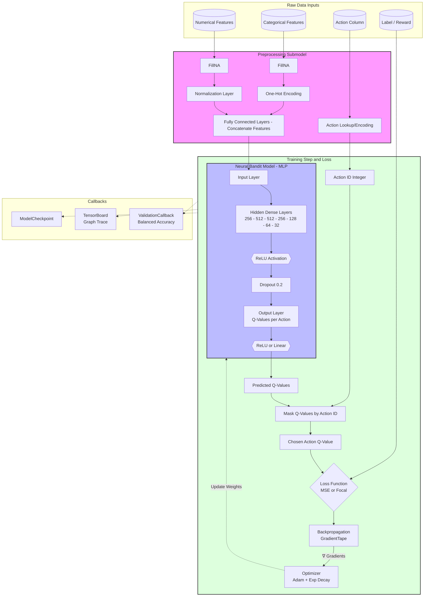
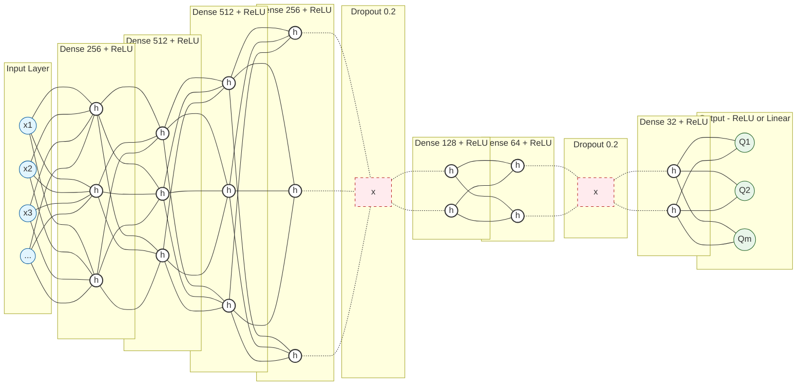

# DNN Architecture Diagrams

This document contains Mermaid diagrams representing the architecture of the Adaptive Contextual Bandits DNN project. These diagrams cover the data flow, preprocessing, model structure (MLP), and training components.

## 1. System Architecture & Data Flow

This diagram illustrates the complete flow from raw input data through preprocessing, the neural network, and the training loop (loss calculation).

**Components:**
*   **Preprocessing (`src/models/preprocessing.py`)**: Handles `FillNA`, `Normalization` (Numerical), `OneHot` (Categorical), and `Action Encoding`.
*   **Neural Bandit Model (`src/models/neural_bandit.py`)**: The Q-Network (MLP).
*   **Training Logic (`src/train.py` & `train_step`)**: Masking Q-values with Action IDs, calculating Loss (MSE/Focal).
*   **Callbacks**: Validation and Logging.

## 2. MLP "Toy" Representation (Perceptron View)

This diagram provides a simplified "Toy" visualization of the Multi-Layer Perceptron (MLP) defined in `src/models/neural_bandit.py`.

*   **Note**: The actual model has Dense layers with [256, 512, 512, 256, 128, 64, 32] neurons, each followed by ReLU activation. Dropout layers (0.2) are placed after Dense 256 and Dense 64. The output layer uses ReLU (for MSE loss) or Linear (for Focal loss). This diagram uses a simplified node count (2-3 nodes per layer) to represent the *connectivity structure*.

## How to View
You can view these diagrams directly in tools that support Mermaid (like GitHub, GitLab, or Obsidian) or paste the code blocks into the [Mermaid Live Editor](https://mermaid.live/).
